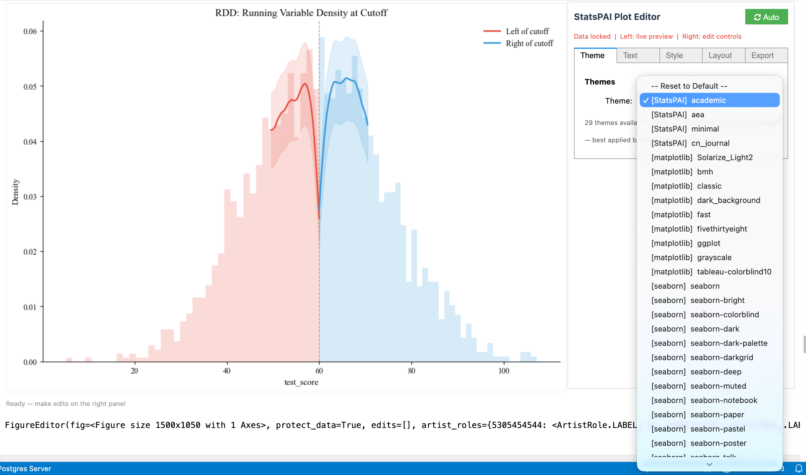

[English](README.md) | [中文](README_CN.md)

# StatsPAI: The Agent-Native Causal Inference & Econometrics Toolkit for Python

[](https://pypi.org/project/StatsPAI/)
[](https://pypi.org/project/StatsPAI/)
[](https://github.com/brycewang-stanford/statspai/blob/main/LICENSE)
[](https://github.com/brycewang-stanford/statspai/actions)
[](https://pepy.tech/projects/statspai)
[](https://joss.theoj.org/papers/9f1c837b1b1df7adfcdd538c3698e332)

StatsPAI is the **agent-native** Python package for causal inference and applied econometrics. One `import`, 390+ functions, covering the complete empirical research workflow — from classical econometrics to cutting-edge ML/AI causal methods to publication-ready tables in Word, Excel, and LaTeX.

**Designed for AI agents**: every function returns structured result objects with self-describing schemas (`list_functions()`, `describe_function()`, `function_schema()`), making StatsPAI the first econometrics toolkit purpose-built for LLM-driven research workflows — while remaining fully ergonomic for human researchers.

It brings R's [Causal Inference Task View](https://cran.r-project.org/web/views/CausalInference.html) (fixest, did, rdrobust, gsynth, DoubleML, MatchIt, CausalImpact, ...) and Stata's core econometrics commands into a single, consistent Python API.

**NEW in v0.6**: `sp.interactive(fig)` — a Stata Graph Editor-style WYSIWYG plot editor for Jupyter, with 29 academic themes, real-time preview, and auto-generated reproducible code.



> Built by the team behind [CoPaper.AI](https://copaper.ai) · Stanford REAP Program

---

## Why StatsPAI?

| Pain point | Stata | R | StatsPAI |
| --- | --- | --- | --- |
| Scattered packages | One environment, but \$695+/yr license | 20+ packages with incompatible APIs | **One `import`, unified API** |
| Publication tables | `outreg2` (limited formats) | `modelsummary` (best-in-class) | **Word + Excel + LaTeX + HTML in every function** |
| Robustness checks | Manual re-runs | Manual re-runs | **`spec_curve()` + `robustness_report()` — one call** |
| Heterogeneity analysis | Manual subgroup splits + forest plots | Manual `lapply` + `ggplot` | **`subgroup_analysis()` with Wald test** |
| Modern ML causal | Limited (no DML, no causal forest) | Fragmented (DoubleML, grf, SuperLearner separate) | **DML, Causal Forest, Meta-Learners, TMLE, DeepIV** |
| Neural causal models | None | None | **TARNet, CFRNet, DragonNet** |
| Causal discovery | None | `pcalg` (complex API) | **`notears()`, `pc_algorithm()`** |
| Policy learning | None | `policytree` (standalone) | **`policy_tree()` + `policy_value()`** |
| Result objects | Inconsistent across commands | Inconsistent across packages | **Unified `CausalResult` with `.summary()`, `.plot()`, `.to_latex()`, `.cite()`** |
| Interactive plot editing | Graph Editor (no code export) | None | **`sp.interactive()` — GUI editing with auto-generated code** |

---

## Complete Feature List

### Regression Models

| Function | Description | Stata equivalent | R equivalent |
| --- | --- | --- | --- |
| `regress()` | OLS with robust/clustered/HAC SE | `reg y x, r` / `vce(cluster c)` | `fixest::feols()` |
| `ivreg()` | IV / 2SLS with first-stage diagnostics | `ivregress 2sls` | `fixest::feols()` with IV |
| `panel()` | Fixed Effects, Random Effects, Between, FD | `xtreg, fe` / `xtreg, re` | `plm::plm()` |
| `heckman()` | Heckman selection model | `heckman` | `sampleSelection::selection()` |
| `qreg()`, `sqreg()` | Quantile regression | `qreg` / `sqreg` | `quantreg::rq()` |
| `tobit()` | Censored regression (Tobit) | `tobit` | `censReg::censReg()` |
| `xtabond()` | Arellano-Bond dynamic panel GMM | `xtabond` | `plm::pgmm()` |
| `glm()` | Generalized Linear Model (6 families × 8 links) | `glm` | `stats::glm()` |
| `logit()`, `probit()` | Binary choice with marginal effects | `logit` / `probit` | `stats::glm(family=binomial)` |
| `mlogit()` | Multinomial logit | `mlogit` | `nnet::multinom()` |
| `ologit()`, `oprobit()` | Ordered logit / probit | `ologit` / `oprobit` | `MASS::polr()` |
| `clogit()` | Conditional logit (McFadden) | `clogit` | `survival::clogit()` |
| `poisson()`, `nbreg()` | Count data (Poisson, Negative Binomial) | `poisson` / `nbreg` | `MASS::glm.nb()` |
| `ppmlhdfe()` | Pseudo-Poisson MLE for gravity models | `ppmlhdfe` | `fixest::fepois()` |
| `zip_model()`, `zinb()` | Zero-inflated Poisson / NegBin | `zip` / `zinb` | `pscl::zeroinfl()` |
| `hurdle()` | Hurdle (two-part) model | — | `pscl::hurdle()` |
| `truncreg()` | Truncated regression (MLE) | `truncreg` | `truncreg::truncreg()` |
| `fracreg()` | Fractional response (Papke-Wooldridge) | `fracreg` | — |
| `betareg()` | Beta regression | — | `betareg::betareg()` |
| `liml()` | LIML (robust to weak IV) | `ivregress liml` | `AER::ivreg()` |
| `jive()` | Jackknife IV (many instruments) | — | — |
| `lasso_iv()` | LASSO-selected instruments | — | — |
| `sureg()` | Seemingly Unrelated Regression | `sureg` | `systemfit::systemfit("SUR")` |
| `three_sls()` | Three-Stage Least Squares | `reg3` | `systemfit::systemfit("3SLS")` |
| `biprobit()` | Bivariate probit | `biprobit` | — |
| `etregress()` | Endogenous treatment effects | `etregress` | — |
| `gmm()` | General GMM (arbitrary moments) | `gmm` | `gmm::gmm()` |
| `frontier()` | Stochastic frontier analysis | `frontier` | `sfa::sfa()` |

### Panel Data (Extended)

| Function | Description | Stata equivalent |
| --- | --- | --- |
| `panel_logit()`, `panel_probit()` | Panel binary (FE conditional / RE / CRE Mundlak) | `xtlogit` / `xtprobit` |
| `panel_fgls()` | FGLS with heteroskedasticity and AR(1) | `xtgls` |
| `interactive_fe()` | Interactive fixed effects (Bai 2009) | — |
| `panel_unitroot()` | Panel unit root (IPS / LLC / Fisher / Hadri) | `xtunitroot` |
| `mixed()` | Multilevel / mixed effects (HLM) | `mixed` |

### Survival / Duration Analysis

| Function | Description | Stata equivalent |
| --- | --- | --- |
| `cox()` | Cox Proportional Hazards | `stcox` |
| `kaplan_meier()` | Kaplan-Meier survival curves | `sts graph` |
| `survreg()` | Parametric AFT (Weibull / exponential / log-normal) | `streg` |
| `logrank_test()` | Log-rank test for group comparison | `sts test` |

### Time Series & Cointegration

| Function | Description | Stata equivalent |
| --- | --- | --- |
| `var()` | Vector Autoregression | `var` |
| `granger_causality()` | Granger causality test | `vargranger` |
| `irf()` | Impulse response functions | `irf graph` |
| `structural_break()` | Bai-Perron structural break test | `estat sbsingle` |
| `cusum_test()` | CUSUM parameter stability test | — |
| `engle_granger()` | Engle-Granger cointegration test | — |
| `johansen()` | Johansen cointegration (trace / max-eigenvalue) | `vecrank` |

### Nonparametric Methods

| Function | Description | Stata equivalent |
| --- | --- | --- |
| `lpoly()` | Local polynomial regression | `lpoly` |
| `kdensity()` | Kernel density estimation | `kdensity` |

### Experimental Design & RCT Tools

| Function | Description |
| --- | --- |
| `randomize()` | Stratified / cluster / block randomization |
| `balance_check()` | Covariate balance with normalized differences |
| `attrition_test()` | Differential attrition analysis |
| `attrition_bounds()` | Lee / Manski bounds under attrition |
| `optimal_design()` | Optimal sample size / cluster design |

### Missing Data

| Function | Description | Stata equivalent |
| --- | --- | --- |
| `mice()` | Multiple Imputation by Chained Equations | `mi impute chained` |
| `mi_estimate()` | Combine estimates via Rubin's rules | `mi estimate` |

### Mendelian Randomization

| Function | Description |
| --- | --- |
| `mendelian_randomization()` | IVW + MR-Egger + Weighted Median MR |
| `mr_plot()` | Scatter plot with MR regression lines |

### Structural Estimation

| Function | Description | Reference |
| --- | --- | --- |
| `blp()` | BLP random-coefficients demand estimation | Berry, Levinsohn & Pakes (1995) |

### Difference-in-Differences

| Function | Description | Reference |
| --- | --- | --- |
| `did()` | Auto-dispatching DID (2×2 or staggered) | — |
| `did_2x2()` | Classic two-group, two-period DID | — |
| `callaway_santanna()` | Staggered DID with heterogeneous effects | Callaway & Sant'Anna (2021) |
| `sun_abraham()` | Interaction-weighted event study | Sun & Abraham (2021) |
| `bacon_decomposition()` | TWFE decomposition diagnostic | Goodman-Bacon (2021) |
| `honest_did()` | Sensitivity to parallel trends violations | Rambachan & Roth (2023) |
| `continuous_did()` | Continuous treatment DID (dose-response) | Callaway, Goodman-Bacon & Sant'Anna (2024) |
| `did_multiplegt()` | DID with treatment switching | de Chaisemartin & D'Haultfoeuille (2020) |
| `did_imputation()` | Imputation DID estimator | Borusyak, Jaravel & Spiess (2024) |
| `distributional_te()` | Distributional treatment effects | Chernozhukov, Fernandez-Val & Melly (2013) |
| `sp.aggte()` | Unified aggregation for staggered DID (simple/dynamic/group/calendar) with Mammen multiplier-bootstrap uniform bands | Callaway & Sant'Anna (2021) §4; Mammen (1993) |
| `sp.cs_report()` | One-call Callaway–Sant'Anna report: estimation + four aggregations + pre-trend test + Rambachan–Roth breakdown M\* | CS2021 + RR2023 |
| `sp.ggdid()` | `aggte()` visualiser with uniform-band overlay | mirrors R `did::ggdid` |

#### DiD parity with `csdid` / `differences` / R `did` + `HonestDiD`

All algorithms below are reimplemented from the original papers — no
wrappers, no runtime dependencies on upstream DID packages.

| Feature | StatsPAI | `csdid` (Py) | `differences` (Py) | R `did` |
| --- | :---: | :---: | :---: | :---: |
| Callaway–Sant'Anna ATT(g,t) with DR / IPW / REG | ✅ | ✅ | ✅ | ✅ |
| Never-treated / not-yet-treated control group | ✅ | ✅ | ✅ | ✅ |
| Anticipation (`anticipation=δ`) | ✅ | ✅ | — | ✅ |
| `aggte`: simple / dynamic / group / calendar | ✅ | ✅ | ✅ | ✅ |
| Mammen multiplier bootstrap, uniform sup-t bands | ✅ | ✅ | — | ✅ |
| `balance_e` / `min_e` / `max_e` | ✅ | ✅ | partial | ✅ |
| Sun–Abraham IW with Liang–Zeger cluster SE | ✅ | — | ✅ | via `fixest::sunab` |
| Borusyak–Jaravel–Spiess imputation + pre-trend Wald | ✅ | — | — | via `didimputation` |
| de Chaisemartin–D'Haultfoeuille switch-on-off | ✅ | — | — | via `DIDmultiplegtDYN` |
| dCDH joint placebo Wald + avg. cumulative effect | ✅ | — | — | ✅ (v2) |
| Rambachan–Roth sensitivity + breakdown M\* | ✅ | — | — | via `HonestDiD` |
| `cs ⇄ aggte ⇄ honest_did` pipeline (single object) | ✅ | partial | partial | partial |
| One-call report card (`cs_report`) | ✅ | — | — | via `summary()` |

### Regression Discontinuity

| Function | Description | Reference |
| --- | --- | --- |
| `rdrobust()` | Sharp/Fuzzy RD with robust bias-corrected inference | Calonico, Cattaneo & Titiunik (2014) |
| `rdplot()` | RD visualization with binned scatter | — |
| `rddensity()` | McCrary density manipulation test | McCrary (2008) |
| `rdmc()` | Multi-cutoff RD | Cattaneo et al. (2024) |
| `rdms()` | Geographic / multi-score RD | Keele & Titiunik (2015) |
| `rkd()` | Regression Kink Design | Card et al. (2015) |

### Matching & Reweighting

| Function | Description | Stata equivalent |
| --- | --- | --- |
| `match()` | PSM, Mahalanobis, CEM with balance diagnostics | `psmatch2` / `cem` |
| `ebalance()` | Entropy balancing | `ebalance` |

### Synthetic Control

| Function | Description | Reference |
| --- | --- | --- |
| `synth()` | Abadie-Diamond-Hainmueller SCM | Abadie et al. (2010) |
| `sdid()` | Synthetic Difference-in-Differences | Arkhangelsky et al. (2021) |
| Placebo inference, gap plots, weight tables, RMSE plots | — | — |

### Machine Learning Causal Inference

| Function | Description | Reference |
| --- | --- | --- |
| `dml()` | Double/Debiased ML (PLR + IRM) with cross-fitting | Chernozhukov et al. (2018) |
| `causal_forest()` | Causal Forest for heterogeneous treatment effects | Wager & Athey (2018) |
| `deepiv()` | Deep IV neural network approach | Hartford et al. (2017) |
| `metalearner()` | S/T/X/R/DR-Learner for CATE estimation | Kunzel et al. (2019), Kennedy (2023) |
| `tmle()` | Targeted Maximum Likelihood Estimation | van der Laan & Rose (2011) |
| `aipw()` | Augmented Inverse-Probability Weighting | — |

### Neural Causal Models

| Function | Description | Reference |
| --- | --- | --- |
| `tarnet()` | Treatment-Agnostic Representation Network | Shalit et al. (2017) |
| `cfrnet()` | Counterfactual Regression Network | Shalit et al. (2017) |
| `dragonnet()` | Dragon Neural Network for CATE | Shi et al. (2019) |

### Causal Discovery

| Function | Description | Reference |
| --- | --- | --- |
| `notears()` | DAG learning via continuous optimization | Zheng et al. (2018) |
| `pc_algorithm()` | Constraint-based causal graph learning | Spirtes et al. (2000) |

### Policy Learning

| Function | Description | Reference |
| --- | --- | --- |
| `policy_tree()` | Optimal treatment assignment rules | Athey & Wager (2021) |
| `policy_value()` | Policy value evaluation | — |

### Conformal & Bayesian Causal Inference

| Function | Description | Reference |
| --- | --- | --- |
| `conformal_cate()` | Distribution-free prediction intervals for ITE | Lei & Candes (2021) |
| `bcf()` | Bayesian Causal Forest (separate mu/tau) | Hahn, Murray & Carvalho (2020) |

### Dose-Response & Multi-valued Treatment

| Function | Description | Reference |
| --- | --- | --- |
| `dose_response()` | Continuous treatment dose-response curve (GPS) | Hirano & Imbens (2004) |
| `multi_treatment()` | Multi-valued treatment AIPW | Cattaneo (2010) |

### Bounds & Partial Identification

| Function | Description | Reference |
| --- | --- | --- |
| `lee_bounds()` | Sharp bounds under sample selection | Lee (2009) |
| `manski_bounds()` | Worst-case bounds (no assumption / MTR / MTS) | Manski (1990) |

### Interference & Spillover

| Function | Description | Reference |
| --- | --- | --- |
| `spillover()` | Direct + spillover + total effect decomposition | Hudgens & Halloran (2008) |

### Dynamic Treatment Regimes

| Function | Description | Reference |
| --- | --- | --- |
| `g_estimation()` | Multi-stage optimal DTR via G-estimation | Robins (2004) |

### Bunching & Tax Policy

| Function | Description | Reference |
| --- | --- | --- |
| `bunching()` | Kink/notch bunching estimator with elasticity | Kleven & Waseem (2013) |

### Matrix Completion (Panel)

| Function | Description | Reference |
| --- | --- | --- |
| `mc_panel()` | Causal panel data via nuclear-norm matrix completion | Athey et al. (2021) |

### Other Causal Methods

| Function | Description | Stata/R equivalent |
| --- | --- | --- |
| `causal_impact()` | Bayesian structural time-series | R `CausalImpact` |
| `mediate()` | Mediation analysis (ACME/ADE) | `medeff` / R `mediation` |
| `bartik()` | Shift-share IV with Rotemberg weights | `bartik_weight` |

### Post-Estimation

| Function | Description | Stata equivalent |
| --- | --- | --- |
| `margins()` | Average marginal effects (AME/MEM) | `margins, dydx(*)` |
| `marginsplot()` | Marginal effects visualization | `marginsplot` |
| `test()` | Wald test for linear restrictions | `test x1 = x2` |
| `lincom()` | Linear combinations with inference | `lincom x1 + x2` |

### Diagnostics & Sensitivity

| Function | Description | Reference |
| --- | --- | --- |
| `oster_bounds()` | Coefficient stability bounds | Oster (2019) |
| `sensemakr()` | Sensitivity to omitted variables | Cinelli & Hazlett (2020) |
| `mccrary_test()` | Density discontinuity test | McCrary (2008) |
| `hausman_test()` | FE vs RE specification test | Hausman (1978) |
| `anderson_rubin_test()` | Weak instrument robust inference | Anderson & Rubin (1949) |
| `evalue()` | E-value sensitivity to unmeasured confounding | VanderWeele & Ding (2017) |
| `het_test()` | Breusch-Pagan / White heteroskedasticity | — |
| `reset_test()` | Ramsey RESET specification test | — |
| `vif()` | Variance Inflation Factor | — |
| `diagnose()` | General model diagnostics | — |

### Smart Workflow Engine *(unique to StatsPAI — no other package has these)*

| Function | Description |
| --- | --- |
| `recommend()` | Given data + research question → recommends estimators with reasoning, generates workflow, provides `.run()` |
| `compare_estimators()` | Runs multiple methods (OLS, matching, IPW, DML, ...) on same data, reports agreement diagnostics |
| `assumption_audit()` | One-call test of ALL assumptions for any method, with pass/fail/remedy for each |
| `sensitivity_dashboard()` | Multi-dimensional sensitivity analysis (sample, outliers, unobservables) with stability grade |
| `pub_ready()` | Journal-specific publication readiness checklist (Top 5 Econ, AEJ, RCT) |
| `replicate()` | Built-in famous datasets (Card 1995, LaLonde 1986, Lee 2008) with replication guides |

### Robustness Analysis *(unique to StatsPAI)*

| Function | Description | R/Stata equivalent |
| --- | --- | --- |
| `spec_curve()` | Specification Curve / Multiverse Analysis | R `specr` (limited) / Stata: none |
| `robustness_report()` | Automated robustness battery (SE variants, winsorize, trim, add/drop controls, subsamples) | None |
| `subgroup_analysis()` | Heterogeneity analysis with forest plot + interaction Wald test | None (manual in both) |

### Inference Methods

| Function | Description |
| --- | --- |
| `wild_cluster_bootstrap()` | Wild cluster bootstrap (Cameron, Gelbach & Miller 2008) |
| `ri_test()` | Randomization inference / Fisher exact test |

### CATE Diagnostics (for Meta-Learners & Causal Forest)

| Function | Description |
| --- | --- |
| `cate_summary()`, `cate_by_group()` | CATE distribution summaries |
| `cate_plot()`, `cate_group_plot()` | CATE visualization |
| `gate_test()` | Group Average Treatment Effect test |
| `blp_test()` | Best Linear Projection test |
| `compare_metalearners()` | Compare S/T/X/R/DR-Learner estimates |

### Publication-Quality Output

| Function | Description | Formats |
| --- | --- | --- |
| `modelsummary()` | Multi-model comparison tables | Text, LaTeX, HTML, Word, Excel, DataFrame |
| `outreg2()` | Stata-style regression table export | Excel, LaTeX, Word |
| `sumstats()` | Summary statistics (Table 1) | Text, LaTeX, HTML, Word, Excel, DataFrame |
| `balance_table()` | Pre-treatment balance check | Text, LaTeX, HTML, Word, Excel, DataFrame |
| `tab()` | Cross-tabulation with chi-squared / Fisher | Text, LaTeX, Word, Excel, DataFrame |
| `coefplot()` | Coefficient forest plot across models | matplotlib Figure |
| `binscatter()` | Binned scatter with residualization | matplotlib Figure |
| `set_theme()` | Publication themes (`'academic'`, `'aea'`, `'minimal'`, `'cn_journal'`) | — |
| `interactive()` | WYSIWYG plot editor with 29 themes & auto code generation | Jupyter ipywidgets |

Every result object has:

```python
result.summary()      # Formatted text summary
result.plot()         # Appropriate visualization
result.to_latex()     # LaTeX table
result.to_docx()      # Word document
result.cite()         # BibTeX citation for the method
```

### Interactive Plot Editor — Python's Answer to Stata Graph Editor

Stata users know the Graph Editor: double-click a figure to enter a WYSIWYG editing interface — drag fonts, change colors, adjust layout. This has been a Stata-exclusive experience. In Python, matplotlib produces static images — changing a title font size means editing code and re-running.

**`sp.interactive(fig)`** turns any matplotlib figure into a live editing panel — figure preview on the left, property controls on the right, just like Stata's Graph Editor. But it does two things Stata can't:

1. **29 academic themes, one-click switching.** From AER journal style to ggplot, FiveThirtyEight, dark presentation mode — select and see the result instantly. Stata's `scheme` requires regenerating the plot; here it's real-time.

2. **Every edit auto-generates reproducible Python code.** Adjust title size, change colors, add annotations in the GUI — the editor records each operation as standard matplotlib code (`ax.set_title(...)`, `ax.spines[...].set_visible(...)`). Copy with one click, paste into your script, and it reproduces exactly. Stata's Graph Editor cannot export edits to do-file commands.

Five tabs cover all editing needs: **Theme** (29 themes) · **Text** (titles, labels, fonts) · **Style** (line colors, widths, markers) · **Layout** (spines, grid, figure size, legend, axis limits) · **Export** (save, undo/redo, reset).

Auto/Manual rendering modes: Auto refreshes the preview on every change; Manual batches edits for a single Apply — useful for large figures or slow machines.

```python
import statspai as sp

result = sp.did(df, y='wage', treat='policy', time='year')
fig, ax = result.plot()
editor = sp.interactive(fig)   # opens the editor

# After editing in the GUI:
editor.copy_code()             # prints reproducible Python code
```

<!-- screenshots will be added here -->

### Utilities

| Function | Description | Stata equivalent |
| --- | --- | --- |
| `label_var()`, `label_vars()` | Variable labeling | `label var` |
| `describe()` | Data description | `describe` |
| `pwcorr()` | Pairwise correlation with significance stars | `pwcorr, star(.05)` |
| `winsor()` | Winsorization | `winsor2` |
| `read_data()` | Multi-format data reader | `use` / `import` |

---

## Installation

```bash
pip install statspai
```

With optional dependencies:

```bash
pip install statspai[plotting]    # matplotlib, seaborn
pip install statspai[fixest]      # pyfixest for high-dimensional FE
```

**Requirements:** Python >= 3.9

**Core dependencies:** NumPy, SciPy, Pandas, statsmodels, scikit-learn, linearmodels, patsy, openpyxl, python-docx

---

## Quick Example

```python
import statspai as sp

# --- Estimation ---
r1 = sp.regress("wage ~ education + experience", data=df, robust='hc1')
r2 = sp.ivreg("wage ~ (education ~ parent_edu) + experience", data=df)
r3 = sp.did(df, y='wage', treat='policy', time='year', id='worker')
r4 = sp.rdrobust(df, y='score', x='running_var', c=0)
r5 = sp.dml(df, y='wage', treat='training', covariates=['age', 'edu', 'exp'])
r6 = sp.causal_forest("y ~ treatment | x1 + x2 + x3", data=df)

# --- Post-estimation ---
sp.margins(r1, data=df)              # Marginal effects
sp.test(r1, "education = experience") # Wald test
sp.oster_bounds(df, y='wage', treat='education', controls=['experience'])

# --- Tables (to Word / Excel / LaTeX) ---
sp.modelsummary(r1, r2, output='table2.docx')
sp.outreg2(r1, r2, r3, filename='results.xlsx')
sp.sumstats(df, vars=['wage', 'education', 'age'], output='table1.docx')

# --- Robustness (unique to StatsPAI) ---
sp.spec_curve(df, y='wage', x='education',
              controls=[[], ['experience'], ['experience', 'female']],
              se_types=['nonrobust', 'hc1']).plot()

sp.robustness_report(df, formula="wage ~ education + experience",
                     x='education', extra_controls=['female'],
                     winsor_levels=[0.01, 0.05]).plot()

sp.subgroup_analysis(df, formula="wage ~ education + experience",
                     x='education',
                     by={'Gender': 'female', 'Region': 'region'}).plot()
```

---

## StatsPAI vs Stata vs R: Honest Comparison

### Where StatsPAI wins

| Advantage | Detail |
| --- | --- |
| **Unified API** | One package, one `import`, consistent `.summary()` / `.plot()` / `.to_latex()` across all methods. Stata requires paid add-ons; R requires 20+ packages with different interfaces. |
| **Modern ML causal methods** | DML, Causal Forest, Meta-Learners (S/T/X/R/DR), TMLE, DeepIV, TARNet/CFRNet/DragonNet, Policy Trees — all in one place. Stata has almost none of these. R has them scattered across incompatible packages. |
| **Robustness automation** | `spec_curve()`, `robustness_report()`, `subgroup_analysis()` — no manual re-running. Neither Stata nor R offers this out-of-the-box. |
| **Free & open source** | MIT license, \$0. Stata costs \$695–\$1,595/year. |
| **Python ecosystem** | Integrates naturally with pandas, scikit-learn, PyTorch, Jupyter, cloud pipelines. |
| **Auto-citations** | Every causal method has `.cite()` returning the correct BibTeX. Neither Stata nor R does this. |
| **Interactive Plot Editor** | `sp.interactive()` — Stata Graph Editor-style GUI in Jupyter with 29 themes and auto-generated reproducible code. Stata's Graph Editor can't export edits to do-file; R has no equivalent. |

### Where Stata still wins

| Advantage | Detail |
| --- | --- |
| **Battle-tested at scale** | 40+ years of production use in economics. Edge cases are well-handled. |
| **Speed on very large datasets** | Stata's compiled C backend is faster for simple OLS/FE on datasets with millions of rows. |
| **Survey data & complex designs** | `svy:` prefix, stratification, clustering — Stata's survey support is unmatched. |
| **Mature documentation** | Every command has a PDF manual with worked examples. Community is massive. |
| **Journal acceptance** | Referees in some fields trust Stata output by default. |

### Where R still wins

| Advantage | Detail |
| --- | --- |
| **Cutting-edge methods** | New econometric methods (e.g., `fixest`, `did2s`, `HonestDiD`) often appear in R first. |
| **`ggplot2` visualization** | R's grammar of graphics is more flexible than matplotlib for complex figures. |
| **`modelsummary`** | R's `modelsummary` is the gold standard for regression tables — StatsPAI's is close but not yet identical. |
| **CRAN quality control** | R packages go through peer review. Python packages vary in quality. |
| **Spatial econometrics** | `spdep`, `spatialreg` — R has a deeper spatial ecosystem. |

---

## API at a Glance

```text
390+ public functions/classes

Regression:     regress, ivreg, glm, logit, probit, mlogit, ologit, poisson, nbreg, ppmlhdfe,
                tobit, heckman, qreg, truncreg, fracreg, betareg, sureg, three_sls, gmm
IV Advanced:    liml, jive, lasso_iv
Panel:          panel, panel_logit, panel_probit, panel_fgls, interactive_fe, xtabond, mixed
DID:            did, callaway_santanna, sun_abraham, bacon_decomposition, honest_did,
                continuous_did, did_multiplegt, did_imputation, stacked_did
RD:             rdrobust, rdplot, rddensity, rdmc, rdms, rkd
Matching:       match, ebalance, ipw, aipw
Synth:          synth, sdid, gsynth, augsynth, staggered_synth, conformal_synth
ML Causal:      dml, causal_forest, deepiv, metalearner, tmle
Neural:         tarnet, cfrnet, dragonnet
Discovery:      notears, pc_algorithm
Policy:         policy_tree, policy_value
Survival:       cox, kaplan_meier, survreg, logrank_test
Time Series:    var, granger_causality, irf, structural_break, johansen, engle_granger
Nonparametric:  lpoly, kdensity
Experimental:   randomize, balance_check, attrition_test, optimal_design
Imputation:     mice, mi_estimate
Frontier:       frontier (stochastic frontier analysis)
Structural:     blp (BLP demand estimation)
MR:             mendelian_randomization, mr_ivw, mr_egger, mr_median
Smart Workflow: recommend, compare_estimators, assumption_audit,
                sensitivity_dashboard, pub_ready, replicate
Output:         modelsummary, outreg2, sumstats, balance_table, tab, coefplot, binscatter
Plot Editor:    interactive (WYSIWYG editor), set_theme (29 academic themes)
```

---

## Release Notes

### v0.6.0 (2026-04-05) — Complete Econometrics Toolkit + Smart Workflow Engine

**30 new modules, 390+ public API, 860+ tests passing, 83K+ lines of code.**

New Regression & GLM:

- `glm()` (6 families × 8 links), `logit()`, `probit()`, `cloglog()`, `mlogit()`, `ologit()`, `oprobit()`, `clogit()`
- `poisson()`, `nbreg()`, `ppmlhdfe()` (gravity model), `zip_model()`, `zinb()`, `hurdle()`
- `truncreg()`, `fracreg()`, `betareg()`, `biprobit()`, `etregress()`
- `liml()`, `jive()`, `lasso_iv()` (advanced IV), `sureg()`, `three_sls()`, `gmm()` (general GMM)

New Panel & Multilevel:

- `panel_logit()`, `panel_probit()` (FE/RE/CRE), `panel_fgls()`, `interactive_fe()` (Bai 2009)
- `panel_unitroot()` (IPS/LLC/Fisher/Hadri), `mixed()` (multilevel/HLM)

New Survival: `cox()`, `kaplan_meier()`, `survreg()`, `logrank_test()`

New Time Series: `var()`, `granger_causality()`, `irf()`, `structural_break()`, `cusum_test()`, `engle_granger()`, `johansen()`

New Causal: `continuous_did()`, `rdmc()`, `rdms()` (geographic RD), `distributional_te()`, `mendelian_randomization()`

New Design & Data: `randomize()`, `balance_check()`, `attrition_test()`, `optimal_design()`, `mice()`, `mi_estimate()`

New Structural: `blp()` (BLP demand estimation), `frontier()` (stochastic frontier)

Smart Workflow Engine (unique to StatsPAI):

- `recommend()` — data + question → estimator recommendation + workflow
- `compare_estimators()` — multi-method comparison with agreement diagnostics
- `assumption_audit()` — one-call assumption testing with remedies
- `sensitivity_dashboard()` — multi-dimensional sensitivity analysis
- `pub_ready()` — journal-specific publication readiness checklist
- `replicate()` — built-in famous datasets with replication guides

Interactive Plot Editor: Font presets redesigned to show actual font names; separate font and size presets for independent per-element control.

### v0.6.2 (2026-04-12) — Weights, Prediction & Validation

- **OLS `predict()`**: Out-of-sample prediction via `result.predict(newdata=)`
- **`balance_panel()`**: Keep only units observed in every period
- **DID/DDD/Event Study weights**: `weights=` parameter for population-weighted estimation
- **Matching `ps_poly=`**: Polynomial propensity score models (Cunningham 2021, Ch. 5)
- **Synth RMSPE plot**: `synthplot(result, type='rmspe')` histogram (Abadie et al. 2010)
- **Graddy (2006) replication**: Fulton Fish Market IV example in `sp.replicate()`
- **Numerical validation**: Cross-validated against Stata/R reference values

### v0.6.1 (2026-04-07) — Interactive Editor Fixes & Improvements

- **Theme switching fix**: Themes now fully reset rcParams before applying, so switching between themes (e.g. ggplot → academic) correctly updates all visual properties
- **Apply button fix**: Fixed being clipped on the Layout tab; now pinned to panel bottom
- **Error visibility**: Widget callback errors now surface in the status bar instead of being silently swallowed
- **Auto mode**: Always refreshes preview when toggled for immediate feedback
- **Theme tab**: Moved to first position; color pickers show confirmation feedback
- **Code generation**: Auto-generate reproducible code with text selection support

### v0.5.1 (2026-04-04) — Interactive Plot Editor & Agent Enhancements

### v0.4.0 (2026-04-05) — Module Architecture Overhaul

**Major refactoring and expansion of core modules (+5,800 lines of new code):**

- **DID**: Added Triple Differences (`ddd()`), one-call `did_analysis()` workflow (auto design detection → Bacon decomposition → estimation → event study → sensitivity), and 8 publication-ready plot functions (`parallel_trends_plot`, `bacon_plot`, `group_time_plot`, `enhanced_event_study_plot`, `treatment_rollout_plot`, `sensitivity_plot`, `cohort_event_study_plot`)
- **Synthetic Control**: Modular rewrite — `demeaned_synth()`, `robust_synth()` (penalized SCM), `gsynth()` (Generalized SCM with interactive fixed effects), `staggered_synth()` (multi-unit staggered adoption), `conformal_synth()` (distribution-free inference), and comprehensive `synth_plot()` / `synth_weight_plot()` / `synth_gap_plot()`
- **Panel**: Major expansion of `panel()` — Hausman test, Breusch-Pagan LM, Pesaran CD, Wooldridge autocorrelation, panel unit root tests; added `panel_summary_plot()`, `fe_plot()`, `re_comparison_plot()`
- **RD**: New `rd_diagnostics()` suite — bandwidth sensitivity, placebo cutoffs, donut-hole robustness, covariate balance at cutoff, density test
- **IV / 2SLS**: Rewritten `ivreg()` with proper first-stage diagnostics (Cragg-Donald, Kleibergen-Paap), weak IV detection, Sargan-Hansen overidentification test, Anderson canonical correlation test, Stock-Yogo critical values
- **Matching**: Enhanced `match()` — added CEM (Coarsened Exact Matching), optimal matching, genetic matching; improved balance diagnostics with Love plot and standardized mean difference
- **DAG**: Expanded `dag()` with 15+ built-in example DAGs (`dag_example()`), `dag_simulate()` for data generation from causal graphs, backdoor/frontdoor criterion identification
- **Causal Impact**: Enhanced Bayesian structural time-series with automatic model selection and improved inference
- **AI Agent Registry**: Expanded `list_functions()`, `describe_function()`, `function_schema()`, `search_functions()` for LLM/agent tool-use integration
- **CausalResult**: Added `.to_json()`, `.to_dict()`, enhanced `.summary()` formatting

### v0.3.1 (2025-12-20)

- Fix PyPI badge displaying stale version

### v0.3.0 (2025-12-20) — ML & Advanced Causal Methods

- **Meta-Learners**: S/T/X/R/DR-Learner for CATE estimation with `compare_metalearners()` and CATE diagnostics (`gate_test`, `blp_test`)
- **Neural Causal Models**: TARNet, CFRNet, DragonNet for deep CATE estimation
- **Causal Discovery**: `notears()` (continuous DAG optimization), `pc_algorithm()` (constraint-based)
- **TMLE**: Targeted Maximum Likelihood Estimation with Super Learner
- **Policy Learning**: `policy_tree()` optimal treatment rules, `policy_value()` evaluation
- **Conformal Causal**: Distribution-free prediction intervals for ITE
- **Bayesian Causal Forest**: `bcf()` with separate prognostic/treatment functions
- **Dose-Response**: Continuous treatment GPS curves
- **Bounds**: Lee bounds (sample selection), Manski bounds (partial identification)
- **Interference**: `spillover()` direct + indirect effect decomposition
- **DTR**: `g_estimation()` multi-stage optimal treatment regimes
- **Multi-Treatment**: AIPW for multi-valued treatments
- **Bunching**: Kink/notch bunching estimator with elasticity
- **Matrix Completion**: `mc_panel()` nuclear-norm panel estimator
- **Robustness**: `spec_curve()`, `robustness_report()`, `subgroup_analysis()`
- **New Regression**: DeepIV, Heckman selection, quantile regression, Tobit, Arellano-Bond GMM
- **New Diagnostics**: E-value, Anderson-Rubin weak IV test, Sensemakr, RD density test
- **Other**: Entropy balancing, Sun-Abraham event study, Bacon decomposition, HonestDiD

### v0.2.0 (2025-11-15) — Post-Estimation & Output

- **Post-Estimation**: `margins()`, `marginsplot()`, `test()`, `lincom()`
- **Output Tables**: `modelsummary()`, `outreg2()`, `sumstats()`, `balance_table()`, `tab()`, `coefplot()`, `binscatter()`
- **Inference**: `wild_cluster_bootstrap()`, `aipw()`, `ri_test()`
- **New Modules**: DML, Causal Forest, Matching (PSM/Mahalanobis), Synthetic Control (ADH + SDID), Panel (FE/RE/FD), Causal Impact, Mediation, Bartik IV
- **Diagnostics**: `oster_bounds()`, `mccrary_test()`, `hausman_test()`, `het_test()`, `reset_test()`, `vif()`
- **Utilities**: Variable labeling, `describe()`, `pwcorr()`, `winsor()`, `read_data()`

### v0.1.0 (2025-10-01) — Initial Release

- Core regression: `regress()` OLS with robust/clustered/HAC standard errors
- Instrumental variables: `ivreg()` 2SLS
- Difference-in-Differences: `did()`, `did_2x2()`, `callaway_santanna()`
- Regression discontinuity: `rdrobust()`
- Unified `CausalResult` object with `.summary()`, `.plot()`, `.to_latex()`, `.to_docx()`, `.cite()`

---

## About

**StatsPAI Inc.** is the research infrastructure company behind [CoPaper.AI](https://copaper.ai) — the AI co-authoring platform for empirical research, born out of Stanford's [REAP](https://reap.fsi.stanford.edu/) program.

**CoPaper.AI** — Upload your data, set your research question, and produce a fully reproducible academic paper with code, tables, and formatted output. Powered by StatsPAI under the hood. [copaper.ai](https://copaper.ai)


**Team:**

- **Bryce Wang** — Founder. Economics, Finance, CS & AI. Stanford REAP.
- **Dr. Scott Rozelle** — Co-founder & Strategic Advisor. Stanford Senior Fellow, author of *Invisible China*.
- 
---

## Contributing

```bash
git clone https://github.com/brycewang-stanford/statspai.git
cd statspai
pip install -e ".[dev,plotting,fixest]"
pytest
```

---

## Citation

```bibtex
@software{wang2025statspai,
  title={StatsPAI: The Causal Inference & Econometrics Toolkit for Python},
  author={Wang, Bryce},
  year={2025},
  url={https://github.com/brycewang-stanford/statspai},
  version={0.6.0}
}
```

## License

MIT License. See [LICENSE](LICENSE).

---

[GitHub](https://github.com/brycewang-stanford/statspai) · [PyPI](https://pypi.org/project/StatsPAI/) · [User Guide](https://github.com/brycewang-stanford/statspai#quick-example) · [CoPaper.AI](https://copaper.ai)
